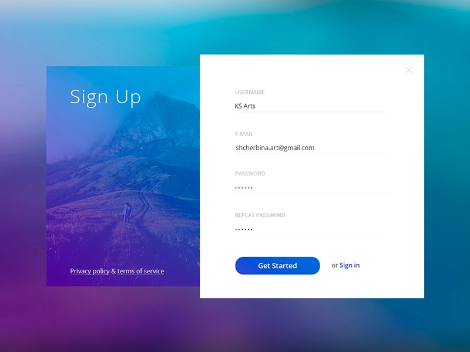

# Signup Form project

_Web Design Project_
<br>
<br>

Design inspiration: 

<br>

## 🌟 About

Simple SignUp form project using HTML and CSS. Leaning flex & positioning

Site published at: https://zukauskas.github.io/signup-project/


## 🎯 Project features/goals

-   HTML & CSS
-   Responsiveness

## 🧰 Getting Started

### 💻 Prerequisites

Node.js - _download and install_

```
https://nodejs.org
```

Git - _download and install_

```
https://git-scm.com
```

### 🏃 Run locally

Would like to run this project locally? Open terminal and follow these steps:

1. Clone the repo
    ```sh
    git clone https://github.com/Zukauskas/signup-project.git
    ```
2. Install NPM packages
    ```sh
    npm i
    ```
    or
    ```sh
    npm install
    ```
3. Run the server
    ```sh
    npm run dev
    ```

### 🧪 Running tests

There is no tests for this project.

## 🎅 Authors

Tautvydas Ž.: 
 - [Github](https://github.com/Zukauskas)
 - [LinkedIn](https://www.linkedin.com/in/tautzuk/)

## ⚠️ License

Distributed under the MIT License. See [LICENSE](./LICENSE) for more information.

## 🔗 Other resources

No other resources.
